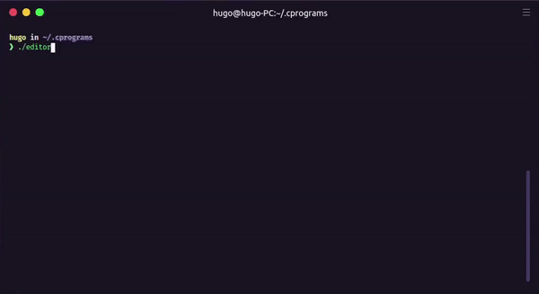

# Command Line Text Editor

  

## References 

https://devdocs.io/c/

http://www.asciitable.com/

https://notes.burke.libbey.me/ansi-escape-codes/

https://viewsourcecode.org/snaptoken/kilo/

https://en.wikipedia.org/wiki/VT100

https://www.youtube.com/watch?v=8G80nuEyDN4&t=225s

https://bixense.com/clicolors/