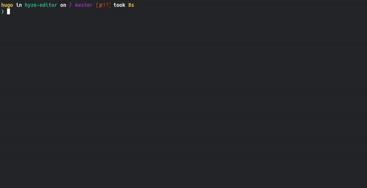

<h1 align="center" id="hyze-header">Hyze Text Editor</h1>

<p align="center">
  
  
  
</p>

<p align="center">Hyze is a command-line source code editor that allows you to create and edit code files in an extremely simple way, it also has features that help with productivity, search, syntax highlighting, etc. Initially based on the <a href="https://github.com/snaptoken/kilo-src">KILO Text Editor</a>.</p>

<p align="center">
  
</p>

# Table of contents

* [Overview](#hyze-header)
* [Getting Started](#getting-started)
  * [Requirements](#requirements)
  * [Download Hyze](#download-hyze)
  * [Building Hyze](#building-hyze)
  * [Executing Hyze](#executing-hyze)
* [Features](#features)
* [Author](#author)
* [Reference Links](#author)

# Getting Started

## Requirements

- [GCC](https://gcc.gnu.org/) The GNU compiler collection includes front-ends for various programming languages.

- [GNU Make](https://www.gnu.org/software/make/) The GNU Make is a tool which controls the generation of executables and other non-source files of a program from the program's source files.

- [GDB](https://www.gnu.org/software/gdb/) (Optional) The GNU Project debugger, allows you to see what is going on `inside' another program while it executes -- or what another program was doing at the moment it crashed.

## Download Hyze

The easiest way to get Hyze onto your computer is using git clone. For more information, see [Git Clone Docs](https://git-scm.com/docs/git-clone).

Once you have git you can get Hyze with the following command line:

```bash
$ git clone https://github.com/hugosrc/hyze-editor.git
```

## Building Hyze

If you don't have Hyze on your computer yet, see the step-by-step how to <a href="#download-hyze">download</a> it.

1. Access the Hyze folder 
```bash
$ cd hyze-editor/
```

2. Create build directory
```bash
$ mkdir build/
```

3. Execute command to start build process.
```bash
$ make build
```

## Executing Hyze

To run hyze is simple, just enter the following command line, replacing the \<filename> with the name of the file to open, if you don't have the file, the argument can be empty.

```bash
$ build/hyze <filename>
```

# Features

- [x] Create and Edit Files
- [x] Vertical and Horizontal Scroll
- [x] Search
- [x] Syntax Highlighting
- [ ] Copy/Paste
- [ ] Auto Bracket Closing
- [ ] Config File (.hyzerc)
- [ ] Auto Indent
- [ ] More Filetypes
- [ ] Multiple Buffers  

# Author

Created by Hugo Souza(hugosr.contato@gmail.com), Contact 👋!

# References Links

- [Kilo Text Editor](https://viewsourcecode.org/snaptoken/kilo/)
- [ASCII Table](http://www.asciitable.com/)
- [ESC Codes](https://notes.burke.libbey.me/ansi-escape-codes/)
- [Standard C Library Functions](https://devdocs.io/c/)
- [Computer Introduction](https://www.youtube.com/watch?v=8G80nuEyDN4)
- [Terminal Colors](https://en.wikipedia.org/wiki/ANSI_escape_code)
- [Delete Original File?](https://superuser.com/questions/1397186/when-a-pc-edits-a-file-does-it-delete-the-original-file)